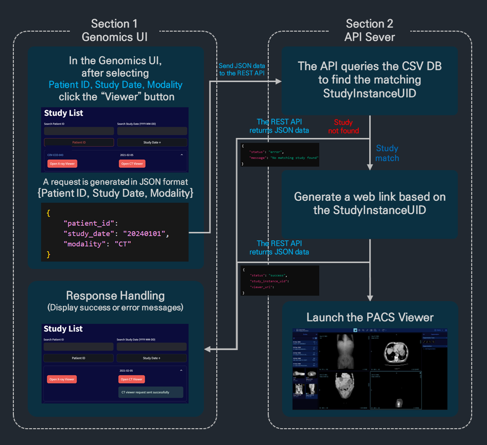

# GenomicsPACS-Linker

## Overview
GenomicsPACS-Linker is a web-based application that provides seamless integration between patient genomic data and medical imaging studies. It enables healthcare professionals to efficiently access and view patient X-ray and CT images through a user-friendly interface.

## Screenshot

*The main interface of GenomicsPACS-Linker showing the study list with search functionality and viewer launch options*

## System Flow

*Detailed system flow diagram showing the interaction between UI and API components*

## Features
- **Searchable Study List**: Filter patients by ID and study date
- **Sortable Columns**: Organize data by patient ID or study date
- **Dual Viewer Support**: Launch both X-ray and CT viewers
- **Pagination**: Efficient handling of large datasets
- **Responsive Design**: Optimized for various screen sizes
- **Real-time Updates**: Immediate viewer launching capability

## System Architecture
The application consists of two main components:
1. **Frontend (app.py)**
   - Built with Streamlit
   - Provides interactive user interface
   - Handles data presentation and filtering
   - Manages user interactions

2. **Backend (api_server.py)**
   - Flask-based API server
   - Manages study metadata
   - Handles viewer launch requests
   - Provides health monitoring endpoints

## Prerequisites
- Python 3.8+
- Required Python packages:
  ```
  streamlit
  pandas
  flask
  flask-cors
  requests
  ```

## Installation
1. Clone the repository:
   ```bash
   git clone https://github.com/Junsu0213/GenomicsPACS-Linker.git
   cd GenomicsPACS-Linker
   ```

2. Install dependencies:
   ```bash
   pip install -r requirements.txt
   ```

## Configuration
1. Update the PACS viewer URL in `api_server.py`:
   ```python
   viewer_url = f"http://your-pacs-server/segmentation?StudyInstanceUIDs={study_instance_uid}"
   ```

2. Ensure your patient metadata CSV file (`patient_metainfo.csv`) is properly formatted with the following columns:
   - Patient_ID
   - Study_Date
   - Modality
   - StudyInstanceUID

## Usage
1. Start the API server:
   ```bash
   python api_server.py
   ```

2. Launch the Streamlit application:
   ```bash
   streamlit run app.py
   ```

3. Access the application through your web browser at `http://localhost:8501`

## API Endpoints
- `POST /api/viewer`
  - Launches PACS viewer for specific study
  - Required payload: `patient_id`, `study_date`, `modality`

- `GET /api/health`
  - Health check endpoint
  - Returns server status

## Authors
- JUN-SU PARK

## Acknowledgments
- Built for Bundang Medical Center
- Special thanks to the BMC IT team for their support

## Contact
For any queries or support, please contact:
- Email: junsupark0213@korea.ac.kr